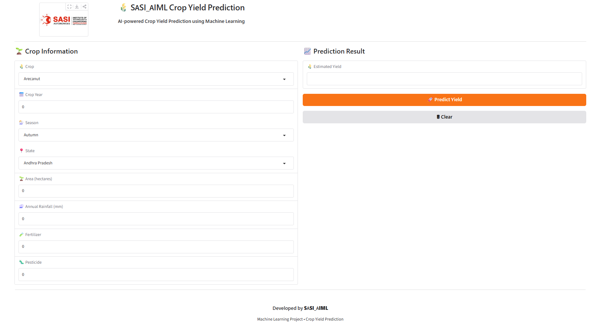

# 🌾 SASI_AIML Crop Yield Prediction

An AI-powered Crop Yield Prediction System built using **Machine Learning** and **Gradio**.

---

## 📖 Project Overview

Crop yield prediction plays a crucial role in modern agriculture by helping farmers and policymakers make informed decisions.

This project uses a **Random Forest Regressor** trained on agricultural data to predict crop yield based on:

- 🌾 Crop
- 📅 Crop Year
- 🌦️ Season
- 📍 State
- 🌱 Area
- 🌧️ Annual Rainfall
- 🧪 Fertilizer
- 🐛 Pesticide

The application provides predictions through an interactive **Gradio web interface**.

---

## 🚀 Features

- 🌾 Machine Learning based prediction
- 📊 Random Forest Regression Model
- 🎨 Interactive Gradio Web Application
- 📍 Dropdown selection for Crop, State and Season
- ✅ Input validation
- ⚡ Instant prediction
- 🖥️ User-friendly interface

---

## 🛠️ Tech Stack

| Category | Technologies |
|----------|--------------|
| Language | Python |
| ML Library | Scikit-Learn |
| Data Processing | Pandas, NumPy |
| Model Storage | Joblib |
| UI | Gradio |

---

## 📂 Project Structure

```text
CropYieldPrediction/
│
├── app/
│   ├── app.py
│   └── assets/
│       └── sasi_logo.png
│
├── data/
│
├── models/
│   ├── random_forest.pkl
│   └── label_encoders.pkl
│
├── notebooks/
│   ├── 01_EDA.ipynb
│   ├── 02_Preprocessing.ipynb
│   ├── 03_Model_Training.ipynb
│   ├── 04_Model_Analysis.ipynb
│   └── 05_Save_Model.ipynb
│
├── requirements.txt
├── README.md
└── .gitignore
```

---

## ⚙️ Installation

Clone the repository

```bash
git clone <repository-url>
```

Move into the project

```bash
cd CropYieldPrediction
```

Create a virtual environment

```bash
python -m venv .venv
```

Activate it

### Windows

```bash
.venv\Scripts\activate
```

Install dependencies

```bash
pip install -r requirements.txt
```

Run the application

```bash
python app/app.py
```

---

## 📸 Application Screenshot



---

## 🔮 Future Enhancements

- 🌦️ Weather API Integration
- 📍 Automatic Location Detection
- 📈 Yield Visualization Charts
- 📄 Download Prediction Report
- ☁️ Cloud Deployment
- 📱 Mobile Responsive UI

---
### Future Improvements
- Train separate models for individual crops (Rice, Wheat, Cotton, etc.) to improve prediction accuracy.
- Apply outlier detection and removal before model training.
- Use district-level weather and soil data for better predictions.

## 👩‍💻 Developed By

**Sara**

B.Tech Artificial Intelligence & Machine Learning

SASI Institute of Technology & Engineering

---